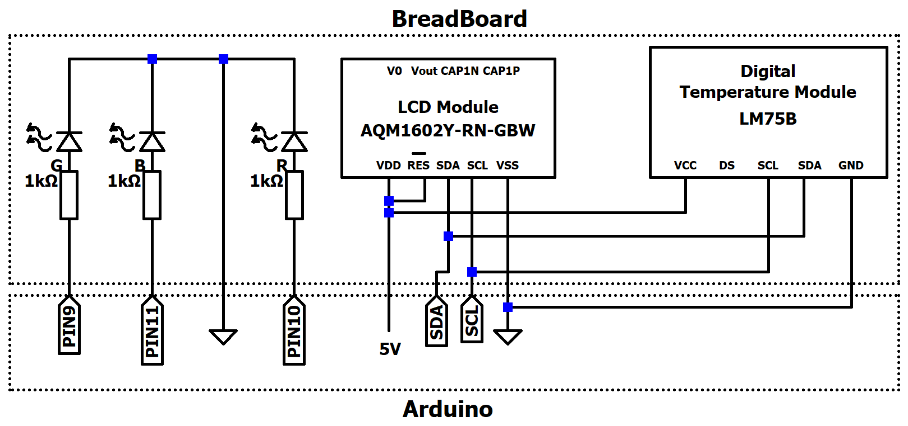
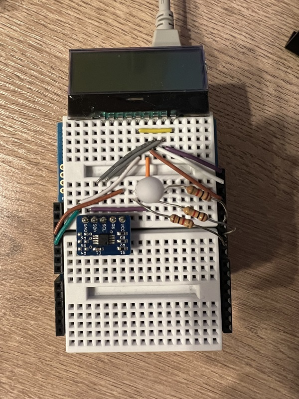
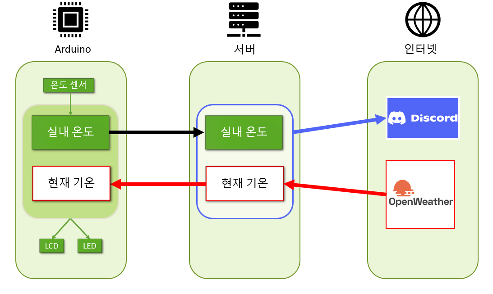
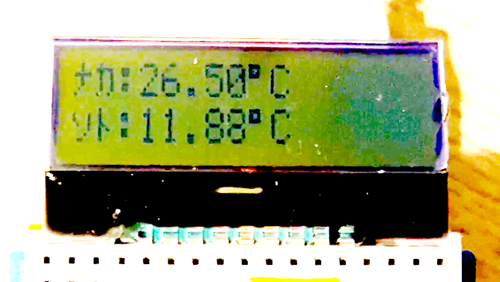
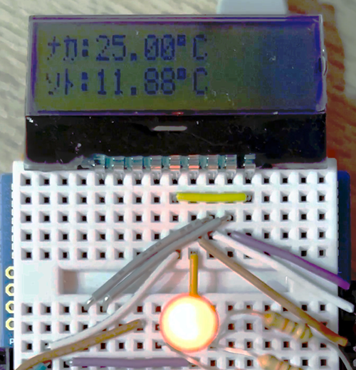

# Arduino-TemperatureSystem

아두이노, OpenWeather와 Discord API를 사용한 온도 표시 시스템

## 사용 주요 부품
1. Arduino Uno
2. 온도 센서 모듈
3. 풀컬러 LED
4. LCD 모듈 AQM1602Y-RN-GBW

# 주의할 점

`arduino.ino` 는 Arduino Uno 에 업로드, `server.py` 는 백엔드 서버로 사용할 PC에서 실행할 것.

`getweather.py` 와 `server.py` 에 각각 본인의 OpenWeather, Discord 의 API 키를 넣어야 정상적으로 동작함.

OpenWeather의 경우 한 달에 100만회까지 호출할 수 있는 API를 무료로 제공함.

날씨를 가져오는 지역을 바꾸고 싶다면 `getweather.py` 의 `city` 변수를 수정해야 함.

# 구현 기능

## 흑백 LCD 표시

윗줄에 `ナカ` (일본어로 안쪽이라는 뜻): `현재 방의 온도` 을 섭씨로 표시함.

아랫줄에 `ソト` (일본어로 바깥쪽이라는 뜻): `현재 외부 기온` 을 섭씨로 표시함.

## 풀컬러 LED 표시
1. R：온도차가 10℃ 이상
2. G：온도차가 5℃ 이상 0℃ 미만
3. B：온도차가 5℃ 미만

온도차가 10℃ 이상이라 빨간색이 점등된 예시

## Discord 에서 실내 온도 보기

`?温度` 라고 송신하면 봇이 현재 기온, 실내 온도, 온도 차를 응답함.